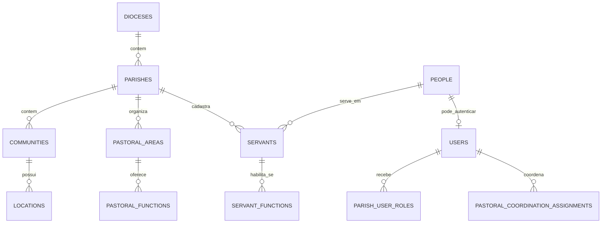
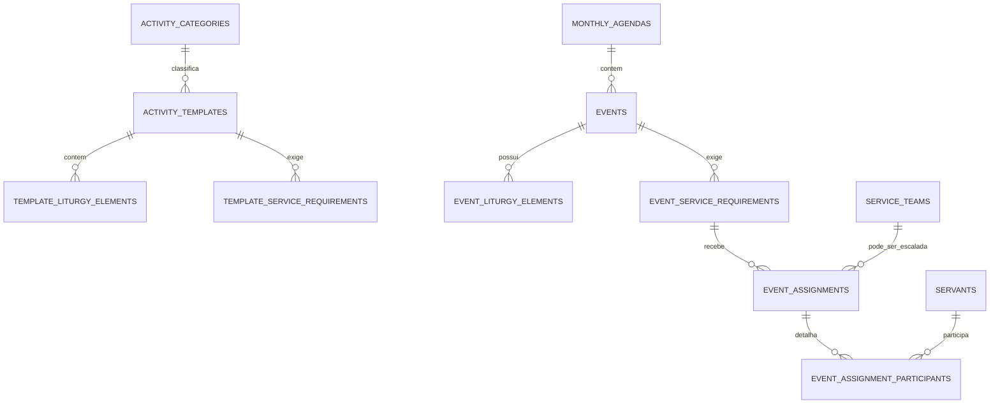

# eclEZapp — contexto do produto e estrutura inicial do banco de dados

> Documento de referência para agentes e desenvolvedores. Leia-o antes de propor ou implementar mudanças no domínio.
>
> **Status:** arquitetura inicial — versão 0.1
> **Data:** 17 de agosto de 2026
> **Banco recomendado:** PostgreSQL 17+
> **Idioma do domínio:** português do Brasil

## 1. Visão do produto

O **eclEZapp** é um software de gestão pastoral para organizar a estrutura paroquial, a agenda mensal de celebrações e adorações, as coordenações pastorais e as escalas de serviço.

O fluxo central é:

1. O pároco ou um administrador autorizado mantém a estrutura da paróquia e de suas comunidades.
2. O pároco prepara, revisa e publica mensalmente a agenda de missas, adorações e outras atividades.
3. Cada atividade nasce de um template, mas pode ser personalizada para aquela ocorrência.
4. O administrador paroquial designa coordenadores para áreas pastorais, como Liturgia, Música e Ministros Extraordinários da Sagrada Comunhão.
5. Cada coordenador escala servos apenas nas funções que pertencem ao seu campo de responsabilidade.
6. O sistema valida quantidade mínima, habilitação, disponibilidade e conflitos de horário antes da publicação definitiva da escala.

## 2. Decisões de domínio obrigatórias

### 2.1 Pessoa, usuário e servo são conceitos diferentes

- **Pessoa (`people`)**: ser humano cadastrado no sistema; é a identidade central.
- **Usuário (`users`)**: credencial de acesso associada a uma pessoa. Usuário autentica e executa ações no sistema.
- **Servo (`servants`)**: vínculo pastoral de uma pessoa com uma paróquia. Pode ser escalado, mas não precisa possuir usuário.

Consequências:

- Um servo pode existir apenas como `people + servants`, sem e-mail, senha ou login.
- Um coordenador precisa de `people + users`, pois necessita acessar o sistema.
- Se o coordenador também puder ser escalado, ele terá ainda um registro em `servants`.
- O pároco normalmente terá `people + users + parish_user_roles`; ele só terá `servants` caso também deva aparecer nas escalas comuns.
- Nunca adicionar `user_id` diretamente em uma escala de serviço. A escala aponta para o servo ou para uma equipe.

Exemplo:

| Pessoa | Usuário | Servo | Resultado |
|---|---:|---:|---|
| João, leitor | Não | Sim | Pode ser escalado, mas não entra no sistema |
| Maria, coordenadora e salmista | Sim | Sim | Coordena e também pode ser escalada |
| Ana, administradora | Sim | Não | Administra, mas não aparece como serva |
| Padre José | Sim | Opcional | Publica a agenda; preside por vínculo próprio |

### 2.2 Template não é evento

- O **template** define a configuração reutilizável de uma atividade: elementos litúrgicos, funções, quantidades e duração sugerida.
- O **evento** é uma ocorrência real, em data, hora, local e agenda mensal determinados.
- Ao criar um evento, os requisitos do template são copiados para tabelas próprias do evento.
- Alterar um template jamais pode modificar retroativamente eventos ou escalas existentes.

### 2.3 Coordenação possui escopo e vigência

Uma coordenação deve informar:

- paróquia e área pastoral;
- usuário coordenador;
- início e fim da designação;
- usuário que realizou a designação;
- estado ativo/inativo.

O coordenador de Música não pode alterar a escala da Liturgia ou dos Ministros da Comunhão sem receber também esse escopo.

### 2.4 Agenda mensal possui ciclo de publicação

Estados sugeridos:

- `DRAFT`: em elaboração pelo pároco/administração;
- `PUBLISHED`: visível para coordenadores e pronta para receber escalas;
- `CLOSED`: escala encerrada, preservada para histórico;
- `CANCELLED`: agenda cancelada sem apagar os registros.

Um evento também possui estado próprio: `DRAFT`, `PUBLISHED`, `CANCELLED` ou `COMPLETED`.

### 2.5 Regras litúrgicas não devem ser codificadas em colunas fixas

Não criar colunas como `first_reader_id`, `psalmist_id` ou `music_ministry_id` em `events`. Missas, adorações e novas atividades têm necessidades diferentes. As partes e os serviços devem ser registros configuráveis.

O Evangelho, por exemplo, é reservado ao diácono ou sacerdote e não deve aparecer como uma função comum de leitor leigo. Presidência, concelebração e diaconia devem ser tratadas separadamente das escalas ordinárias de servos.

## 3. Escopo funcional inicial

### Incluído no MVP

- dioceses, paróquias, comunidades e locais;
- pessoas, usuários e servos;
- papéis administrativos por paróquia;
- áreas e funções pastorais;
- designação de coordenadores;
- habilitação de servos por função;
- equipes de serviço, especialmente equipes de música;
- templates de missa, adoração e novos tipos criados pela paróquia;
- agenda mensal;
- eventos e requisitos copiados do template;
- escala de pessoas ou equipes;
- confirmação, recusa, substituição e registro de presença;
- alerta de choque de horários;
- auditoria das ações sensíveis.

### Fora do MVP, mas compatível com o modelo

- indisponibilidades recorrentes dos servos;
- geração automática da agenda por regras de recorrência;
- notificações por aplicativo, WhatsApp, e-mail ou SMS;
- leitura automática do calendário litúrgico;
- hinários e repertórios do Ministério de Música;
- inventário, financeiro e secretaria sacramental;
- integração diocesana entre várias paróquias.

## 4. Papéis e permissões

| Papel/condição | Permissões principais |
|---|---|
| `PARISH_PRIEST` | Gerir a paróquia, revisar/publicar agenda, designar administradores e coordenadores, autorizar exceções |
| `PARISH_ADMIN` | Manter cadastros e agenda conforme delegação do pároco; designar coordenações quando autorizado |
| Coordenador pastoral | Escalar e acompanhar apenas as funções de sua área durante a vigência da coordenação |
| Usuário comum | Consultar dados liberados e manter o próprio perfil |
| Servo sem usuário | Nenhum acesso; apenas pode constar em equipes e escalas |

`COORDINATOR` não deve ser apenas um papel global. A autorização real vem de `pastoral_coordination_assignments`, com área e vigência definidas.

## 5. Visão geral dos relacionamentos





## 6. Convenções técnicas

- Chaves primárias: `uuid`, geradas com `gen_random_uuid()`.
- Datas e horários reais: `timestamptz` em UTC; exibição conforme `parishes.timezone`.
- Competência mensal: `date`, sempre normalizada para o primeiro dia do mês.
- Campos de vigência: intervalo semiaberto `[início, fim)` para não gerar sobreposição na troca de coordenação.
- Exclusão lógica: preferir `status` ou `archived_at`; não apagar histórico de agenda, escalas ou coordenações.
- Auditoria mínima: `created_at`, `updated_at` e, nas ações de domínio, `created_by_user_id`/`updated_by_user_id`.
- Nomes técnicos em inglês; rótulos exibidos ao usuário em português.
- Valores estáveis de enum devem ser códigos em maiúsculas; nomes apresentados ao usuário permanecem editáveis.
- Dados sensíveis e contatos devem seguir LGPD, controle de acesso por paróquia e coleta mínima necessária.

## 7. Estrutura proposta das tabelas

### 7.1 Estrutura eclesial

#### `dioceses`

| Coluna | Tipo | Regra |
|---|---|---|
| `id` | `uuid` | PK |
| `name` | `varchar(160)` | obrigatório |
| `canonical_name` | `varchar(160)` | opcional |
| `city`, `state`, `country_code` | texto | localização |
| `timezone` | `varchar(64)` | IANA, ex.: `America/Fortaleza` |
| `status` | enum | `ACTIVE`, `INACTIVE` |
| `created_at`, `updated_at` | `timestamptz` | auditoria |

#### `parishes`

| Coluna | Tipo | Regra |
|---|---|---|
| `id` | `uuid` | PK |
| `diocese_id` | `uuid` | FK `dioceses`, obrigatório |
| `name` | `varchar(160)` | obrigatório |
| `patron_name` | `varchar(160)` | opcional |
| `timezone` | `varchar(64)` | obrigatório |
| `status` | enum | `ACTIVE`, `INACTIVE` |
| `created_at`, `updated_at` | `timestamptz` | auditoria |

#### `communities`

| Coluna | Tipo | Regra |
|---|---|---|
| `id` | `uuid` | PK |
| `parish_id` | `uuid` | FK `parishes`, obrigatório |
| `name` | `varchar(160)` | obrigatório |
| `is_parish_seat` | `boolean` | identifica a matriz |
| `status` | enum | `ACTIVE`, `INACTIVE` |
| `created_at`, `updated_at` | `timestamptz` | auditoria |

Restrição: nome da comunidade único dentro da mesma paróquia.

#### `locations`

Representa igreja, capela, salão, residência ou outro local de atividade.

| Coluna | Tipo | Regra |
|---|---|---|
| `id` | `uuid` | PK |
| `parish_id` | `uuid` | FK obrigatório para isolamento dos dados |
| `community_id` | `uuid` | FK opcional |
| `name` | `varchar(160)` | obrigatório |
| `location_type` | enum | `CHURCH`, `CHAPEL`, `HALL`, `HOME`, `OTHER` |
| `address_json` | `jsonb` | endereço estruturado |
| `status` | enum | `ACTIVE`, `INACTIVE` |

### 7.2 Identidade e acesso

#### `people`

| Coluna | Tipo | Regra |
|---|---|---|
| `id` | `uuid` | PK |
| `full_name` | `varchar(180)` | obrigatório |
| `preferred_name` | `varchar(100)` | opcional |
| `birth_date` | `date` | opcional e protegido |
| `phone` | `varchar(32)` | opcional |
| `email` | `citext` | opcional; não é credencial por si só |
| `notes` | `text` | acesso restrito |
| `created_at`, `updated_at` | `timestamptz` | auditoria |

Evitar CPF no MVP. Se futuramente for realmente necessário, armazenar de modo protegido, com justificativa de finalidade e acesso restrito.

#### `users`

| Coluna | Tipo | Regra |
|---|---|---|
| `id` | `uuid` | PK |
| `person_id` | `uuid` | FK `people`, `UNIQUE`, obrigatório |
| `login_email` | `citext` | `UNIQUE`, obrigatório |
| `password_hash` | `text` | nulo se houver provedor externo |
| `auth_provider` | `varchar(40)` | `LOCAL`, `GOOGLE`, etc. |
| `status` | enum | `INVITED`, `ACTIVE`, `BLOCKED`, `DISABLED` |
| `last_login_at` | `timestamptz` | opcional |
| `created_at`, `updated_at` | `timestamptz` | auditoria |

#### `parish_user_memberships`

Concede ao usuário acesso básico ao ambiente da paróquia.

| Coluna | Tipo | Regra |
|---|---|---|
| `id` | `uuid` | PK |
| `parish_id` | `uuid` | FK obrigatório |
| `user_id` | `uuid` | FK obrigatório |
| `status` | enum | `INVITED`, `ACTIVE`, `SUSPENDED`, `ENDED` |
| `joined_at`, `ended_at` | `timestamptz` | vigência |

Restrição única: `(parish_id, user_id)`.

#### `role_catalog`

Catálogo técnico inicial: `PARISH_PRIEST`, `PARISH_ADMIN` e `PARISH_VIEWER`.

#### `parish_user_roles`

| Coluna | Tipo | Regra |
|---|---|---|
| `id` | `uuid` | PK |
| `parish_id` | `uuid` | FK obrigatório |
| `user_id` | `uuid` | FK obrigatório |
| `role_id` | `uuid` | FK `role_catalog` |
| `starts_on`, `ends_on` | `date` | vigência |
| `granted_by_user_id` | `uuid` | quem concedeu |

Não usar esta tabela para substituir a coordenação pastoral com escopo.

### 7.3 Organização pastoral e servos

#### `pastoral_areas`

Instância de uma área dentro da paróquia.

| Coluna | Tipo | Regra |
|---|---|---|
| `id` | `uuid` | PK |
| `parish_id` | `uuid` | FK obrigatório |
| `code` | `varchar(60)` | ex.: `LITURGY`, `MUSIC`, `COMMUNION_MINISTERS` |
| `name` | `varchar(140)` | nome exibido |
| `description` | `text` | opcional |
| `status` | enum | `ACTIVE`, `INACTIVE` |

Restrição única: `(parish_id, code)`.

#### `pastoral_functions`

Funções escaláveis pertencentes a uma área pastoral.

| Coluna | Tipo | Regra |
|---|---|---|
| `id` | `uuid` | PK |
| `pastoral_area_id` | `uuid` | FK obrigatório |
| `code` | `varchar(80)` | estável dentro da área |
| `name` | `varchar(140)` | ex.: Leitor da primeira leitura |
| `assignment_mode` | enum | `PERSON`, `TEAM`, `EITHER` |
| `requires_qualification` | `boolean` | valida habilitação |
| `status` | enum | `ACTIVE`, `INACTIVE` |

Exemplos: `FIRST_READER`, `SECOND_READER`, `PSALMIST`, `PRAYERS_READER`, `COMMUNION_MINISTER`, `MUSIC_TEAM`, `VOCALIST` e `INSTRUMENTALIST`.

#### `pastoral_coordination_assignments`

| Coluna | Tipo | Regra |
|---|---|---|
| `id` | `uuid` | PK |
| `pastoral_area_id` | `uuid` | FK obrigatório |
| `user_id` | `uuid` | FK obrigatório; deve ser membro ativo da paróquia |
| `starts_on`, `ends_on` | `date` | vigência |
| `status` | enum | `ACTIVE`, `ENDED`, `REVOKED` |
| `appointed_by_user_id` | `uuid` | pároco/admin autorizado |
| `notes` | `text` | opcional |
| `created_at`, `updated_at` | `timestamptz` | auditoria |

Pode haver mais de um coordenador simultâneo na mesma área se a paróquia desejar. Não permitir períodos duplicados para o mesmo usuário e área.

#### `servants`

| Coluna | Tipo | Regra |
|---|---|---|
| `id` | `uuid` | PK |
| `parish_id` | `uuid` | FK obrigatório |
| `person_id` | `uuid` | FK `people`, obrigatório |
| `status` | enum | `ACTIVE`, `INACTIVE`, `SUSPENDED` |
| `joined_on`, `left_on` | `date` | histórico do vínculo |
| `created_by_user_id` | `uuid` | quem cadastrou |
| `created_at`, `updated_at` | `timestamptz` | auditoria |

Restrição única: `(parish_id, person_id)`. Não existe dependência obrigatória com `users`.

#### `servant_functions`

| Coluna | Tipo | Regra |
|---|---|---|
| `id` | `uuid` | PK |
| `servant_id` | `uuid` | FK obrigatório |
| `pastoral_function_id` | `uuid` | FK obrigatório |
| `status` | enum | `PENDING`, `QUALIFIED`, `SUSPENDED`, `EXPIRED` |
| `qualified_on`, `expires_on` | `date` | opcional |
| `approved_by_user_id` | `uuid` | responsável pela habilitação |
| `notes` | `text` | opcional |

Regra: servo e função precisam pertencer à mesma paróquia.

#### `service_teams`

Permite escalar uma equipe inteira, especialmente um Ministério de Música.

| Coluna | Tipo | Regra |
|---|---|---|
| `id` | `uuid` | PK |
| `parish_id` | `uuid` | FK obrigatório |
| `pastoral_area_id` | `uuid` | FK obrigatório |
| `name` | `varchar(140)` | obrigatório |
| `status` | enum | `ACTIVE`, `INACTIVE` |

#### `service_team_members`

| Coluna | Tipo | Regra |
|---|---|---|
| `id` | `uuid` | PK |
| `service_team_id` | `uuid` | FK obrigatório |
| `servant_id` | `uuid` | FK obrigatório |
| `team_role` | `varchar(100)` | ex.: vocal, guitarra, teclado |
| `starts_on`, `ends_on` | `date` | vigência |

Restrição: equipe e servo pertencem à mesma paróquia.

### 7.4 Templates

#### `activity_categories`

Categorias iniciais: `MASS`, `ADORATION` e `OTHER`. A categoria orienta regras gerais; o template representa a configuração concreta.

#### `activity_templates`

| Coluna | Tipo | Regra |
|---|---|---|
| `id` | `uuid` | PK |
| `parish_id` | `uuid` | FK obrigatório; template operacional sempre pertence à paróquia |
| `category_id` | `uuid` | FK obrigatório |
| `name` | `varchar(160)` | ex.: Missa dominical |
| `description` | `text` | opcional |
| `source_blueprint_code` | `varchar(100)` | opcional; identifica o modelo-base usado no cadastro |
| `default_duration_minutes` | `smallint` | maior que zero |
| `version` | `integer` | incrementada a cada mudança estrutural |
| `status` | enum | `DRAFT`, `ACTIVE`, `ARCHIVED` |
| `created_by_user_id` | `uuid` | usuário que criou ou importou o template |
| `created_at`, `updated_at` | `timestamptz` | auditoria |

Templates oferecidos pelo sistema são **modelos-base** clonados para a paróquia durante a configuração. Isso permite que `template_service_requirements` referencie funções pastorais da paróquia sem cruzar dados entre locatários.

#### `liturgy_element_types`

Catálogo de partes litúrgicas: `FIRST_READING`, `RESPONSORIAL_PSALM`, `SECOND_READING`, `UNIVERSAL_PRAYERS`, `GOSPEL`, `HYMN` e outras. Nem todo elemento gera uma vaga de escala.

#### `template_liturgy_elements`

| Coluna | Tipo | Regra |
|---|---|---|
| `id` | `uuid` | PK |
| `template_id` | `uuid` | FK obrigatório |
| `liturgy_element_type_id` | `uuid` | FK obrigatório |
| `sort_order` | `smallint` | ordem no roteiro |
| `is_required` | `boolean` | obrigatório no evento |
| `notes` | `text` | instrução opcional |

#### `template_service_requirements`

| Coluna | Tipo | Regra |
|---|---|---|
| `id` | `uuid` | PK |
| `template_id` | `uuid` | FK obrigatório |
| `pastoral_function_id` | `uuid` | função responsável |
| `label` | `varchar(160)` | rótulo para aquele template |
| `assignment_mode` | enum | `PERSON` ou `TEAM` |
| `minimum_required` | `smallint` | zero ou mais |
| `maximum_allowed` | `smallint` | maior ou igual ao mínimo |
| `sort_order` | `smallint` | ordem de exibição |
| `notes` | `text` | orientação opcional |

### 7.5 Agenda e eventos

#### `monthly_agendas`

| Coluna | Tipo | Regra |
|---|---|---|
| `id` | `uuid` | PK |
| `parish_id` | `uuid` | FK obrigatório |
| `reference_month` | `date` | primeiro dia do mês |
| `status` | enum | `DRAFT`, `PUBLISHED`, `CLOSED`, `CANCELLED` |
| `created_by_user_id` | `uuid` | pároco/admin autorizado |
| `published_by_user_id` | `uuid` | opcional |
| `published_at`, `closed_at` | `timestamptz` | ciclo de vida |
| `notes` | `text` | opcional |
| `created_at`, `updated_at` | `timestamptz` | auditoria |

Restrição única: `(parish_id, reference_month)`.

#### `events`

| Coluna | Tipo | Regra |
|---|---|---|
| `id` | `uuid` | PK |
| `monthly_agenda_id` | `uuid` | FK obrigatório |
| `parish_id` | `uuid` | FK redundante intencional para isolamento/RLS |
| `community_id` | `uuid` | FK opcional |
| `location_id` | `uuid` | FK obrigatório |
| `source_template_id` | `uuid` | FK opcional; origem histórica |
| `source_template_version` | `integer` | versão usada na criação |
| `category_id` | `uuid` | categoria copiada |
| `title` | `varchar(180)` | ex.: Missa do 20º Domingo do Tempo Comum |
| `starts_at`, `ends_at` | `timestamptz` | fim maior que início |
| `presider_person_id` | `uuid` | FK `people`, opcional |
| `status` | enum | `DRAFT`, `PUBLISHED`, `CANCELLED`, `COMPLETED` |
| `created_by_user_id`, `updated_by_user_id` | `uuid` | auditoria de domínio |
| `cancellation_reason` | `text` | obrigatório ao cancelar |
| `created_at`, `updated_at` | `timestamptz` | auditoria |

Validações: o evento deve pertencer ao mês da agenda, salvo exceção explícita; agenda, paróquia, comunidade e local precisam ser compatíveis.

#### `event_liturgy_elements`

Snapshot das partes litúrgicas do template, permitindo referências e textos próprios da celebração.

| Coluna | Tipo | Regra |
|---|---|---|
| `id` | `uuid` | PK |
| `event_id` | `uuid` | FK obrigatório |
| `source_template_element_id` | `uuid` | FK opcional |
| `liturgy_element_type_id` | `uuid` | FK obrigatório |
| `title` | `varchar(180)` | opcional |
| `scripture_reference` | `varchar(180)` | ex.: `Jr 29,11-14` |
| `content` | `text` | texto ou orientação, conforme permissão de uso |
| `sort_order` | `smallint` | ordem |

#### `event_service_requirements`

Snapshot dos serviços necessários. É a entidade que o coordenador efetivamente preenche.

| Coluna | Tipo | Regra |
|---|---|---|
| `id` | `uuid` | PK |
| `event_id` | `uuid` | FK obrigatório |
| `source_template_requirement_id` | `uuid` | FK opcional |
| `pastoral_area_id` | `uuid` | área responsável copiada |
| `pastoral_function_id` | `uuid` | função de origem |
| `label_snapshot` | `varchar(160)` | preserva o nome histórico |
| `assignment_mode` | enum | `PERSON` ou `TEAM` |
| `minimum_required` | `smallint` | quantidade mínima |
| `maximum_allowed` | `smallint` | quantidade máxima |
| `sort_order` | `smallint` | exibição |
| `notes` | `text` | opcional |

O coordenador só pode editar requisitos cujo `pastoral_area_id` esteja dentro de uma coordenação ativa sua.

### 7.6 Escalas

#### `event_assignments`

Representa a decisão de escalar uma pessoa ou uma equipe para um requisito.

| Coluna | Tipo | Regra |
|---|---|---|
| `id` | `uuid` | PK |
| `event_service_requirement_id` | `uuid` | FK obrigatório |
| `servant_id` | `uuid` | preenchido em escala individual |
| `service_team_id` | `uuid` | preenchido em escala de equipe |
| `status` | enum | `ASSIGNED`, `CONFIRMED`, `DECLINED`, `REPLACED`, `CANCELLED`, `COMPLETED`, `ABSENT` |
| `assigned_by_user_id` | `uuid` | coordenador responsável |
| `assigned_at`, `responded_at` | `timestamptz` | histórico |
| `notes` | `text` | opcional |
| `created_at`, `updated_at` | `timestamptz` | auditoria |

Restrição `CHECK`: exatamente um entre `servant_id` e `service_team_id` deve estar preenchido. Não apagar uma escala substituída; marcar `REPLACED` e registrar a nova.

#### `event_assignment_participants`

Materializa as pessoas efetivamente vinculadas à escala. Para uma equipe, os membros ativos são copiados no momento da escala; mudanças posteriores na equipe não alteram o histórico.

| Coluna | Tipo | Regra |
|---|---|---|
| `id` | `uuid` | PK |
| `event_assignment_id` | `uuid` | FK obrigatório |
| `servant_id` | `uuid` | FK obrigatório |
| `source` | enum | `DIRECT`, `TEAM_SNAPSHOT`, `MANUAL_ADDITION` |
| `status` | enum | `ASSIGNED`, `CONFIRMED`, `DECLINED`, `REPLACED`, `COMPLETED`, `ABSENT` |
| `created_at`, `updated_at` | `timestamptz` | auditoria |

Essa tabela também é a fonte para alertas individuais e presença.

#### `schedule_commitments`

Tabela técnica derivada para impedir duas escalas simultâneas do mesmo servo.

| Coluna | Tipo | Regra |
|---|---|---|
| `id` | `uuid` | PK |
| `event_assignment_participant_id` | `uuid` | FK `event_assignment_participants`, único |
| `servant_id` | `uuid` | FK obrigatório |
| `event_id` | `uuid` | FK obrigatório |
| `occupied_period` | `tstzrange` | intervalo `[início, fim)` |
| `active` | `boolean` | falso para recusa/cancelamento/substituição |

No PostgreSQL, usar `btree_gist` e uma restrição de exclusão para impedir períodos ativos sobrepostos do mesmo servo:

```sql
EXCLUDE USING gist (
  servant_id WITH =,
  occupied_period WITH &&
) WHERE (active);
```

A aplicação ou trigger transacional deve sincronizar `schedule_commitments` quando horário, participante ou estado mudar. Para membros de equipe, criar um compromisso por participante materializado.

### 7.7 Auditoria

#### `audit_logs`

| Coluna | Tipo | Regra |
|---|---|---|
| `id` | `uuid` | PK |
| `parish_id` | `uuid` | escopo |
| `actor_user_id` | `uuid` | usuário responsável |
| `action` | `varchar(80)` | ex.: `AGENDA_PUBLISHED`, `ASSIGNMENT_REPLACED` |
| `entity_type` | `varchar(80)` | tipo do agregado |
| `entity_id` | `uuid` | identificador afetado |
| `before_data`, `after_data` | `jsonb` | somente dados necessários |
| `occurred_at` | `timestamptz` | instante da ação |
| `ip_address` | `inet` | opcional e protegido |

Auditar, no mínimo: mudanças de papéis, coordenações, publicação/cancelamento de agenda, mudança de horário, escalas, substituições e autorizações de exceção.

## 8. Exemplo de templates iniciais

### Missa dominical

Elementos litúrgicos sugeridos:

1. primeira leitura;
2. salmo responsorial;
3. segunda leitura;
4. Evangelho — registrado no roteiro, mas não como vaga de leitor leigo;
5. preces da comunidade.

Requisitos de escala configuráveis:

| Área | Função | Mínimo | Máximo | Modo |
|---|---|---:|---:|---|
| Liturgia | Leitor da primeira leitura | 1 | 1 | Pessoa |
| Liturgia | Salmista | 1 | 1 | Pessoa |
| Liturgia | Leitor da segunda leitura | 1 | 1 | Pessoa |
| Liturgia | Leitor das preces | 1 | 1 | Pessoa |
| Ministros da Comunhão | Ministro da Comunhão | `X` | `X` | Pessoa |
| Música | Ministério de Música | 1 | 1 | Equipe |

`X` é configurado pela paróquia ou ajustado na ocorrência conforme assembleia, número de pontos de distribuição e orientação pastoral.

### Missa ferial das 5h30

Elementos e requisitos iniciais:

| Área | Função | Quantidade | Observação |
|---|---|---:|---|
| Liturgia | Leitor da primeira leitura | 1 | Primeira e única leitura antes do Evangelho |
| Liturgia | Salmista | 1 | Pode haver regra local de acumulação de função |

Não incluir segunda leitura, preces escaladas, equipe de música ou ministros extraordinários por padrão se a realidade dessa celebração não os exigir. O pároco pode ajustar cada ocorrência.

### Adoração ao Santíssimo Sacramento

O template deve ser configurável porque a forma concreta varia. Pode conter dirigente, equipe de música, leitores ou turnos de guarda. Exposição, reposição e bênção não devem ser tratadas como uma função leiga genérica: a elegibilidade precisa respeitar a disciplina litúrgica e a autorização do pároco.

## 9. Regras de negócio essenciais

1. Somente `PARISH_PRIEST` ou `PARISH_ADMIN` autorizado cria, publica, fecha ou cancela a agenda mensal.
2. A paróquia de todos os registros relacionados deve coincidir.
3. Um coordenador só escala requisitos de sua área e dentro da vigência de sua designação.
4. Um servo inativo, suspenso ou não habilitado não pode receber nova escala em função restrita.
5. Uma equipe inativa não pode ser escalada.
6. Escala individual exige `assignment_mode = PERSON` ou `EITHER`; escala de equipe exige `TEAM` ou `EITHER` na função de origem.
7. A quantidade de escalas ativas deve respeitar o mínimo e o máximo do requisito.
8. A publicação final da escala deve falhar quando houver requisito mínimo não preenchido, salvo exceção do pároco com justificativa auditada.
9. O mesmo servo não pode ocupar eventos com horários sobrepostos. Convém permitir um tempo de deslocamento configurável no futuro.
10. Alterar o horário de um evento exige revalidar todos os participantes.
11. Cancelamentos, recusas e substituições desativam compromissos, mas preservam o histórico.
12. Alterações no template só afetam eventos criados depois da mudança.
13. Atribuir uma equipe cria um snapshot de seus membros; mudanças futuras na composição não reescrevem a escala antiga.
14. O celebrante/presidente é uma pessoa vinculada ao evento, não uma vaga comum de servo.
15. Exclusões físicas de eventos e escalas publicadas devem ser proibidas.

## 10. Índices e restrições prioritários

- `UNIQUE (parish_id, reference_month)` em `monthly_agendas`.
- `UNIQUE (parish_id, person_id)` em `servants`.
- `UNIQUE (parish_id, user_id)` em `parish_user_memberships`.
- `UNIQUE (parish_id, code)` em `pastoral_areas`.
- `UNIQUE (pastoral_area_id, code)` em `pastoral_functions`.
- Índice em `events (parish_id, starts_at)`.
- Índice em `events (monthly_agenda_id, status)`.
- Índice em `event_service_requirements (event_id, pastoral_area_id)`.
- Índice em `event_assignment_participants (servant_id, status)`.
- Índices parciais para coordenações, servos, equipes e escalas ativas.
- `CHECK (ends_at > starts_at)` em `events`.
- `CHECK (maximum_allowed >= minimum_required AND minimum_required >= 0)` nos requisitos.
- `CHECK` de exatamente um destinatário em `event_assignments`.
- Restrição GiST contra compromissos sobrepostos.
- FKs compostas ou triggers para impedir cruzamento acidental entre paróquias.

## 11. Transações importantes

### Criar evento a partir de template

Executar em uma única transação:

1. validar template, agenda, paróquia e autorização;
2. inserir `events` com a versão de origem;
3. copiar partes para `event_liturgy_elements`;
4. copiar necessidades para `event_service_requirements`;
5. registrar auditoria.

### Escalar servo ou equipe

Executar em uma única transação:

1. bloquear logicamente o requisito para evitar excesso concorrente;
2. validar coordenação ativa, paróquia, função, habilitação e limite;
3. criar `event_assignments`;
4. materializar `event_assignment_participants`;
5. criar `schedule_commitments` e detectar conflito;
6. registrar auditoria;
7. enfileirar notificação depois do commit, se existir integração.

### Alterar horário do evento

Executar em uma única transação e revalidar todos os compromissos antes de confirmar. Se houver choque, rejeitar a mudança ou exigir tratamento explícito de cada conflito.

## 12. Segurança e isolamento

- Toda requisição autenticada deve resolver uma paróquia ativa e verificar o vínculo do usuário.
- Aplicar autorização no backend; ocultar botões no frontend não é controle de acesso.
- Considerar Row-Level Security por `parish_id` no PostgreSQL.
- Queries de coordenação devem validar área e vigência no instante da ação.
- Contatos e observações pastorais não devem aparecer em listagens públicas.
- Senhas nunca são armazenadas em texto puro; usar algoritmo moderno fornecido pelo framework.
- Tokens de convite e recuperação precisam ser curtos, expirados e armazenados como hash.
- Logs não devem copiar textos pastorais sensíveis sem necessidade.

## 13. Questões que precisam de decisão do responsável pelo produto

O modelo aceita as duas opções; não bloquear a arquitetura enquanto estas respostas não forem definidas:

1. Uma pessoa poderá servir simultaneamente em mais de uma paróquia usando a mesma conta?
2. Coordenadores poderão criar e editar templates ou apenas preencher escalas?
3. A agenda será publicada primeiro para coordenadores e depois para toda a comunidade, em dois estágios distintos?
4. Um servo sem usuário confirmará presença por meio do coordenador, link temporário ou não haverá confirmação?
5. Equipes de música serão escaladas como grupo fechado ou será necessário escolher músicos individualmente em cada celebração?
6. Haverá comunidades com coordenadores próprios, além da coordenação paroquial?
7. O sistema precisará registrar diáconos, concelebrantes e ministros instituídos já no MVP?
8. Templates poderão ser compartilhados pela diocese ou serão exclusivamente do sistema/paróquia?

## 14. Orientações para futuros agentes

- Preserve a separação `people`, `users` e `servants`.
- Não transforme requisitos variáveis em colunas fixas no evento.
- Preserve snapshots de templates, equipes e rótulos históricos.
- Não conceda poderes de coordenação por um booleano genérico.
- Toda tabela de domínio paroquial deve possuir `parish_id` direto ou uma cadeia inequívoca e validada até a paróquia.
- Antes de gerar migrations, confirme as questões abertas da seção 13.
- Ao implementar, crie testes de autorização, multi-tenancy, concorrência de escala, conflito de horário, snapshot de template e histórico de substituição.
- Regras litúrgicas específicas devem ser configuráveis quando dependem da realidade local, mas nunca devem permitir atribuições contrárias às funções próprias de ministros ordenados ou autorizados.

## 15. Próxima entrega técnica recomendada

Após validar este documento com o responsável pelo produto:

1. fechar as questões da seção 13;
2. produzir migrations PostgreSQL do núcleo;
3. criar seeds para papéis, categorias, áreas, funções e templates iniciais;
4. implementar políticas de autorização;
5. implementar o agregado de agenda/template e seus testes;
6. implementar o agregado de escala e o controle transacional de conflitos;
7. somente então definir telas e endpoints definitivos.
