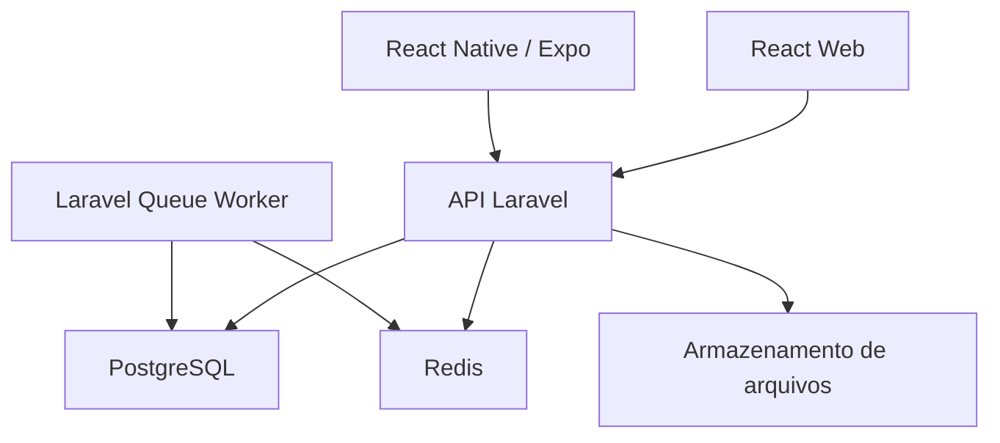
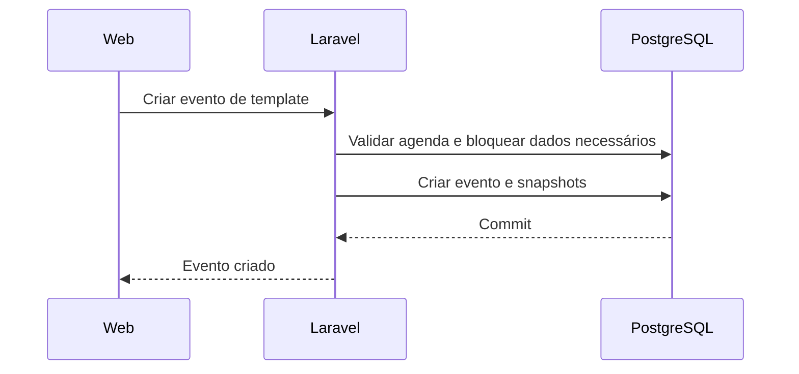
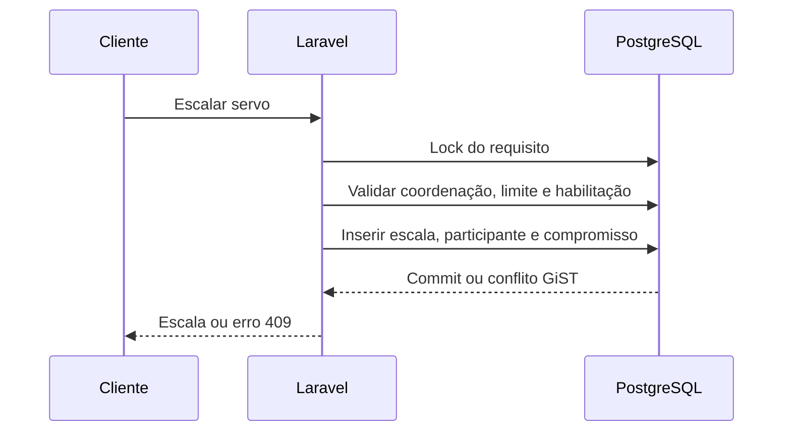

# eclEZapp — guia de arquitetura e desenvolvimento

> Documento de execução para agentes e desenvolvedores responsáveis por implementar o eclEZapp.
>
> **Status:** arquitetura técnica inicial — versão 0.1
> **Data:** 17 de agosto de 2026
> **Documento de domínio obrigatório:** `ECLEZAPP_AGENTS_AND_DATABASE.md`

## 1. Finalidade deste documento

Este guia transforma a modelagem de domínio do eclEZapp em um plano implementável com:

- **React + TypeScript** para a aplicação web administrativa;
- **React Native + TypeScript**, utilizando Expo, para Android e iOS;
- **PHP 8.4 + Laravel 13** para a API e as regras de negócio;
- **PostgreSQL 17+** como banco relacional;
- **Redis** para filas, cache, limitação de requisições e coordenação de tarefas assíncronas;
- Docker Compose para o ambiente local.

Este arquivo não substitui a modelagem do banco. Em caso de conflito:

1. decisões explícitas mais recentes do responsável pelo produto;
2. `ECLEZAPP_AGENTS_AND_DATABASE.md` para regras pastorais e entidades;
3. este documento para implementação técnica;
4. código existente e testes automatizados.

Antes de alterar uma regra de negócio, atualize primeiro a documentação correspondente e registre uma decisão arquitetural quando houver impacto relevante.

## 2. Objetivos arquiteturais

1. Garantir que um **servo possa ser escalado sem possuir usuário**.
2. Impedir vazamento de dados entre paróquias.
3. Centralizar regras no backend para evitar comportamentos diferentes entre web e aplicativo.
4. Preservar histórico de templates, eventos, equipes, escalas e substituições.
5. Evitar choque de horários mesmo diante de requisições concorrentes.
6. Permitir que a primeira versão seja mantida por uma equipe pequena.
7. Crescer de uma paróquia para várias sem reescrever o núcleo.
8. Funcionar bem em conexões móveis instáveis, sem permitir edições offline inseguras.
9. Ser auditável, acessível e compatível com os princípios da LGPD.

## 3. Decisões arquiteturais

### 3.1 Monólito modular

O backend será um **monólito modular Laravel**. Não iniciar com microserviços.

Motivos:

- agenda, escala, autorização e detecção de conflitos fazem parte da mesma transação;
- uma equipe pequena consegue desenvolver, testar e operar uma única aplicação com menor custo;
- módulos internos mantêm os limites do domínio sem impor complexidade distribuída;
- filas podem executar notificações e tarefas pesadas de forma assíncrona sem separar serviços prematuramente.

Separar um módulo em serviço independente somente quando existirem métricas, restrições operacionais ou equipes autônomas que justifiquem a mudança.

### 3.2 Uma API para web e mobile

React e React Native consomem a mesma API versionada. Não duplicar regras pastorais nos clientes.

Os clientes podem validar formulários para melhorar a experiência, mas o backend sempre repete validação, autorização e invariantes.

### 3.3 REST JSON e contrato OpenAPI

A API usará HTTP/JSON sob `/api/v1`. Um contrato OpenAPI versionado será a origem dos tipos e do cliente TypeScript compartilhado.

Não manter manualmente interfaces TypeScript que copiem respostas PHP. Gerar os tipos do contrato e detectar alterações incompatíveis na integração contínua.

### 3.4 Multi-tenancy por linha

As paróquias compartilham a mesma aplicação e o mesmo banco, com `parish_id` isolando os registros. A paróquia é explícita nas rotas:

```text
/api/v1/parishes/{parishId}/agendas
/api/v1/parishes/{parishId}/servants
```

Nunca confiar no `parishId` fornecido pelo cliente sem validar o vínculo e a permissão do usuário autenticado.

### 3.5 Web e mobile compartilham contratos, não interface

Podem ser compartilhados:

- cliente e tipos gerados da API;
- chaves de consulta;
- códigos de erro;
- formatação sem dependência de plataforma;
- tokens de cor, tipografia e espaçamento;
- regras de apresentação que não sejam regras de negócio.

Não compartilhar por padrão:

- componentes React DOM com componentes React Native;
- bibliotecas de navegação;
- acesso a armazenamento;
- gerenciamento de sessão;
- componentes complexos de calendário.

## 4. Topologia



No MVP, o armazenamento de arquivos pode ser local em desenvolvimento e compatível com S3 em produção. Não guardar documentos binários diretamente no PostgreSQL.

## 5. Stack de referência

| Camada | Tecnologia | Decisão |
|---|---|---|
| Backend | PHP 8.4 + Laravel 13 | Base estável, tipada e com suporte de segurança conhecido |
| API | Laravel HTTP Resources + OpenAPI | REST JSON versionado |
| Autenticação | Laravel Sanctum | Cookie/sessão para SPA; token revogável para mobile |
| Banco | PostgreSQL 17+ | UUID, `tstzrange`, GiST, JSONB e transações |
| Cache/fila | Redis | Cache, filas, locks e rate limiting |
| Web | React + TypeScript + Vite | SPA administrativa |
| Estado remoto | TanStack Query | Cache e sincronização de dados do servidor |
| Formulários | React Hook Form + Zod | UX e validação de forma no cliente |
| Mobile | React Native + Expo + Expo Router | Android/iOS com navegação baseada em arquivos |
| Segredo mobile | Expo SecureStore | Armazenamento do token no dispositivo |
| Monorepo JS | pnpm workspaces | Dependências e pacotes compartilhados |
| Teste backend | Pest sobre PHPUnit | Testes unitários e de integração |
| Teste web | Vitest + Testing Library + Playwright | Unidade, componente e fluxo real |
| Teste mobile | Jest + React Native Testing Library | Unidade e integração; E2E em dispositivo em fluxo crítico |
| Qualidade PHP | Laravel Pint + PHPStan/Larastan | Formatação e análise estática |
| Qualidade TS | ESLint + Prettier + `tsc --noEmit` | Lint, estilo e checagem de tipos |

### Política de versões

- Fixar versões por `composer.lock` e `pnpm-lock.yaml`.
- Fixar Node LTS em `.nvmrc` ou `.tool-versions`.
- Fixar a versão do pnpm por `packageManager` no `package.json`.
- No mobile, usar a versão do React Native suportada pelo Expo SDK escolhido; não forçar uma combinação diferente.
- Atualizações devem passar por testes, build web, build mobile de verificação e análise de breaking changes.
- Não usar `latest` em imagens de produção.

## 6. Estrutura do repositório

Usar um monorepo:

```text
eclezapp/
├── apps/
│   ├── api/                    # Laravel 13 / PHP 8.4
│   ├── web/                    # React + Vite
│   └── mobile/                 # React Native + Expo
├── packages/
│   ├── api-client/             # cliente e tipos gerados do OpenAPI
│   ├── design-tokens/          # cores, tipografia e espaçamento
│   ├── query-keys/             # chaves e convenções de cache
│   ├── eslint-config/          # regras compartilhadas
│   └── tsconfig/               # configurações TypeScript compartilhadas
├── docs/
│   ├── ECLEZAPP_AGENTS_AND_DATABASE.md
│   ├── ECLEZAPP_DEVELOPMENT_GUIDE.md
│   ├── api/
│   │   └── openapi.yaml
│   └── adr/                    # Architecture Decision Records
├── infra/
│   ├── docker/
│   └── nginx/
├── .github/workflows/          # ou equivalente no provedor Git
├── compose.yaml
├── Makefile
├── package.json
├── pnpm-workspace.yaml
└── README.md
```

O aplicativo mobile deve ser executado no host durante o desenvolvimento com emulador ou dispositivo. Colocá-lo obrigatoriamente dentro do Docker costuma dificultar acesso ao emulador, USB, Metro e rede local.

## 7. Arquitetura do backend

### 7.1 Módulos

| Módulo | Responsabilidade |
|---|---|
| `Identity` | Pessoas, usuários, convites, autenticação e vínculos com paróquias |
| `EcclesialStructure` | Dioceses, paróquias, comunidades e locais |
| `PastoralOrganization` | Áreas, funções, coordenações, servos e equipes |
| `Templates` | Categorias, templates, elementos litúrgicos e requisitos de serviço |
| `Scheduling` | Agendas mensais, eventos, horários, locais e presidência |
| `Rostering` | Escalas, participantes, confirmações, substituições e conflitos |
| `Audit` | Registro imutável de ações sensíveis |
| `Notifications` | E-mails, push e lembretes; assíncrono e posterior ao núcleo |
| `Shared` | Identificadores, relógio, transações, erros e componentes transversais |

### 7.2 Estrutura interna sugerida

```text
apps/api/app/Modules/Rostering/
├── Actions/
│   ├── AssignServant.php
│   ├── AssignTeam.php
│   ├── ReplaceAssignment.php
│   └── ChangeParticipantStatus.php
├── Data/
│   └── AssignmentData.php
├── Enums/
│   └── AssignmentStatus.php
├── Events/
│   ├── AssignmentCreated.php
│   └── AssignmentDeclined.php
├── Exceptions/
│   ├── AssignmentLimitReached.php
│   └── ScheduleConflict.php
├── Http/
│   ├── Controllers/
│   ├── Requests/
│   └── Resources/
├── Jobs/
├── Models/
├── Policies/
├── Queries/
└── Services/
```

Não criar camadas vazias apenas para satisfazer o desenho. Um módulo ganha uma classe quando existe responsabilidade real.

### 7.3 Regras de implementação

- Controllers devem orquestrar HTTP, nunca conter regra pastoral complexa.
- `FormRequest` valida forma, tipo e presença; Actions/Services validam invariantes de domínio.
- Policies e serviços de autorização verificam paróquia, papel, área e vigência.
- Eloquent Models representam persistência, mas operações críticas passam por Actions transacionais.
- Usar PHP Enums para estados estáveis.
- Usar casts para UUID, datas, enums e JSON.
- Não criar um `BaseRepository` genérico.
- Criar Query Objects quando uma consulta começar a concentrar filtros ou joins relevantes.
- Eventos de domínio representam fatos ocorridos, não comandos disfarçados.
- Jobs que dependem de uma transação só podem ser despachados após o commit.
- Horário corrente deve vir de uma abstração de relógio nos testes, não de chamadas espalhadas a `now()`.

### 7.4 Agregados principais

#### Template

Raiz: `activity_templates`.

Responsável por:

- nome, categoria, duração e versão;
- elementos litúrgicos;
- requisitos de serviço;
- ativação e arquivamento.

Alteração estrutural incrementa `version`. Template arquivado não cria novos eventos, mas permanece referenciado pelo histórico.

#### Agenda mensal

Raiz: `monthly_agendas`.

Responsável por:

- competência;
- conjunto de eventos;
- publicação, fechamento e cancelamento;
- autorização do pároco/administração.

#### Evento

Raiz: `events`.

Responsável por:

- data, hora, local, comunidade e presidência;
- snapshots litúrgicos e de serviço;
- estado da ocorrência;
- revalidação das escalas quando o horário muda.

#### Escala

Raiz operacional: `event_service_requirements`, com `event_assignments` e participantes.

Responsável por:

- limite mínimo e máximo;
- pessoa ou equipe escalada;
- confirmação, recusa, ausência e substituição;
- materialização dos membros da equipe;
- compromisso de horário;
- auditoria.

## 8. Banco de dados e migrations

### 8.1 Ordem sugerida

1. extensões PostgreSQL: `pgcrypto`, `citext` e `btree_gist`;
2. estrutura eclesial;
3. pessoas, usuários, vínculos e papéis;
4. áreas, funções, coordenações e servos;
5. equipes e membros;
6. categorias e templates;
7. agendas e eventos;
8. requisitos e escalas;
9. compromissos de horário;
10. auditoria;
11. tabelas de autenticação, filas e cache do Laravel.

### 8.2 Padrões de migration

- `uuid` em todas as PKs de domínio.
- `foreignUuid` com política de exclusão explícita.
- `restrict` para entidades históricas; `cascade` apenas em filhos inseparáveis ainda não publicados.
- `timestamptz` para instantes.
- competência mensal normalizada para o primeiro dia do mês.
- índices compostos começando por `parish_id` nas consultas paroquiais.
- nomes explícitos para constraints importantes.
- migration de dados separada de alteração estrutural quando houver grande volume.
- nenhuma migration publicada pode ser editada; correções entram em nova migration.

### 8.3 Concorrência

Para escalar uma pessoa ou equipe:

1. iniciar transação;
2. carregar o requisito com `SELECT ... FOR UPDATE`;
3. validar coordenador e vigência;
4. contar atribuições ativas;
5. validar habilitação e paróquia;
6. criar atribuição e participantes;
7. inserir compromissos com a constraint GiST;
8. gravar auditoria;
9. confirmar transação;
10. disparar notificações após o commit.

A constraint do banco é a última defesa contra choque de horário. Uma consulta prévia melhora a mensagem de erro, mas não substitui a constraint.

### 8.4 Bloqueio otimista

Adicionar `lock_version` aos agregados com edição concorrente, especialmente templates, agendas e eventos. O cliente envia a versão lida. Se outra edição já tiver sido confirmada, retornar HTTP `409` com o código `STALE_VERSION`.

## 9. Autenticação e autorização

### 9.1 Sem cadastro público no MVP

Usuários podem criar uma conta antes de possuir paróquia. O autocadastro não cria vínculo paroquial, papel ou registro em `servants`. Padres, administradores e coordenadores recebem vínculo e autorização por fluxo paroquial próprio. Servos sem usuário são cadastrados pelo padre, administrador ou coordenação autorizada e não recebem credenciais automaticamente.

### 9.2 Web

Usar Laravel Sanctum com autenticação de SPA por cookie de sessão e proteção CSRF:

1. SPA solicita `/sanctum/csrf-cookie`;
2. envia `POST /login`;
3. API cria sessão segura;
4. requisições seguintes usam cookie `HttpOnly`, `Secure` em produção e `SameSite` apropriado;
5. `POST /logout` encerra a sessão.

Web e API devem compartilhar o mesmo domínio principal, por exemplo:

```text
app.eclezapp.com.br
api.eclezapp.com.br
```

Não armazenar token de autenticação da SPA em `localStorage`.

### 9.3 Mobile

Usar token Sanctum revogável:

1. `POST /api/v1/mobile/sessions` recebe credenciais e identificação do dispositivo;
2. API retorna o token somente na criação;
3. aplicativo guarda o token no Expo SecureStore;
4. requisições usam `Authorization: Bearer ...`;
5. logout revoga o token daquele dispositivo;
6. tela de segurança permite revogar outros dispositivos.

Não guardar token em AsyncStorage. Definir prazo de expiração e política de reautenticação antes do lançamento.

### 9.4 Autorização

Usar uma combinação de RBAC e regras contextuais:

- RBAC para `PARISH_PRIEST`, `PARISH_ADMIN` e `PARISH_VIEWER`;
- vínculo ativo com a paróquia;
- coordenação ativa para a área pastoral;
- estado do agregado;
- propriedade e compatibilidade dos registros.

Exemplo para criar uma escala:

```text
usuário autenticado
AND vínculo ativo com a paróquia
AND coordenação ativa na área do requisito
AND evento permite escala
AND servo/equipe pertence à mesma paróquia
AND função e habilitação são compatíveis
```

O frontend pode esconder ações proibidas, mas a Policy do backend é obrigatória.

## 10. Contrato da API

### 10.1 Convenções

- Prefixo: `/api/v1`.
- JSON em `snake_case` para manter consistência com Laravel e banco.
- Datas: `YYYY-MM-DD`.
- Instantes: ISO 8601 em UTC, com `Z`.
- UUID como string.
- Paginação por cursor em listas grandes; paginação simples é aceitável nas pequenas no MVP.
- Busca textual com parâmetro `search`.
- Filtros explícitos, por exemplo `filter[status]=ACTIVE`.
- Ordenação explícita, por exemplo `sort=starts_at` ou `sort=-created_at`.
- `request_id` em respostas e logs.
- Requisições de criação sensíveis aceitam `Idempotency-Key` para tolerar repetição no mobile.

### 10.2 Resposta de sucesso

```json
{
  "data": {
    "id": "7ec52276-52d1-4dc3-92df-14c5f85425a8",
    "status": "PUBLISHED"
  },
  "meta": {
    "request_id": "req_01J..."
  }
}
```

### 10.3 Erro padronizado

Adotar um formato inspirado em Problem Details:

```json
{
  "type": "https://api.eclezapp.com.br/problems/roster-conflict",
  "title": "Conflito de escala",
  "status": 409,
  "code": "ROSTER_CONFLICT",
  "detail": "O servo já está escalado em outro evento nesse horário.",
  "errors": {},
  "meta": {
    "request_id": "req_01J...",
    "conflicting_event_id": "18d5c363-c124-48b0-b48a-a75e9494d385"
  }
}
```

### 10.4 Códigos HTTP

| Código | Uso |
|---:|---|
| `200` | consulta ou ação concluída |
| `201` | recurso criado |
| `204` | ação sem corpo |
| `400` | requisição inválida fora da validação de campos |
| `401` | não autenticado |
| `403` | autenticado, mas sem autorização |
| `404` | recurso inexistente ou invisível no escopo atual |
| `409` | conflito de horário, versão, estado ou duplicidade |
| `422` | validação de campos ou regra apresentável no formulário |
| `429` | limite de requisições |

Não usar `500` para regra de negócio conhecida.

### 10.5 Endpoints iniciais

#### Sessão e contexto

| Método | Rota | Finalidade |
|---|---|---|
| `POST` | `/login` | sessão web |
| `POST` | `/logout` | encerra sessão web |
| `POST` | `/api/v1/mobile/sessions` | cria sessão/token mobile |
| `DELETE` | `/api/v1/mobile/sessions/current` | revoga token atual |
| `GET` | `/api/v1/me` | pessoa, usuário, paróquias e permissões |
| `GET` | `/api/v1/parishes` | paróquias acessíveis |

#### Estrutura e organização

| Método | Rota | Finalidade |
|---|---|---|
| `GET/POST` | `/api/v1/parishes/{parish}/communities` | listar/criar comunidades |
| `GET/POST` | `/api/v1/parishes/{parish}/locations` | listar/criar locais |
| `GET/POST` | `/api/v1/parishes/{parish}/pastoral-areas` | áreas pastorais |
| `GET/POST` | `/api/v1/parishes/{parish}/pastoral-functions` | funções escaláveis |
| `GET/POST` | `/api/v1/parishes/{parish}/coordinations` | designações de coordenação |

#### Pessoas, servos e equipes

| Método | Rota | Finalidade |
|---|---|---|
| `GET/POST` | `/api/v1/parishes/{parish}/servants` | pesquisar/cadastrar servos |
| `GET/PATCH` | `/api/v1/parishes/{parish}/servants/{servant}` | consultar/editar vínculo |
| `POST` | `/api/v1/parishes/{parish}/servants/{servant}/functions` | habilitar função |
| `GET/POST` | `/api/v1/parishes/{parish}/service-teams` | equipes |
| `POST` | `/api/v1/parishes/{parish}/service-teams/{team}/members` | incluir membro |

Criar um servo pode criar uma nova pessoa ou reutilizar uma pessoa encontrada. A API deve tratar possíveis duplicidades de nome/telefone sem fundir automaticamente pessoas distintas.

#### Templates

| Método | Rota | Finalidade |
|---|---|---|
| `GET/POST` | `/api/v1/parishes/{parish}/templates` | listar/criar templates |
| `GET/PATCH` | `/api/v1/parishes/{parish}/templates/{template}` | consultar/editar |
| `POST` | `/api/v1/parishes/{parish}/templates/{template}/activate` | ativar |
| `POST` | `/api/v1/parishes/{parish}/templates/{template}/archive` | arquivar |
| `POST` | `/api/v1/parishes/{parish}/templates/from-blueprint` | clonar modelo-base |

#### Agenda e eventos

| Método | Rota | Finalidade |
|---|---|---|
| `GET/POST` | `/api/v1/parishes/{parish}/agendas` | listar/criar competência |
| `GET` | `/api/v1/parishes/{parish}/agendas/{agenda}` | agenda com eventos |
| `POST` | `/api/v1/parishes/{parish}/agendas/{agenda}/events/from-template` | criar snapshot |
| `PATCH` | `/api/v1/parishes/{parish}/events/{event}` | editar ocorrência |
| `POST` | `/api/v1/parishes/{parish}/agendas/{agenda}/publish` | publicar agenda |
| `POST` | `/api/v1/parishes/{parish}/agendas/{agenda}/close` | encerrar |
| `POST` | `/api/v1/parishes/{parish}/events/{event}/cancel` | cancelar evento |

#### Escalas

| Método | Rota | Finalidade |
|---|---|---|
| `GET` | `/api/v1/parishes/{parish}/events/{event}/requirements` | necessidades e preenchimento |
| `POST` | `/api/v1/parishes/{parish}/requirements/{requirement}/assignments` | escalar servo/equipe |
| `POST` | `/api/v1/parishes/{parish}/assignments/{assignment}/replace` | substituir preservando histórico |
| `POST` | `/api/v1/parishes/{parish}/assignments/{assignment}/confirm` | confirmar |
| `POST` | `/api/v1/parishes/{parish}/assignments/{assignment}/decline` | recusar |
| `POST` | `/api/v1/parishes/{parish}/assignments/{assignment}/complete` | registrar serviço |
| `GET` | `/api/v1/parishes/{parish}/servants/{servant}/schedule` | agenda do servo |

Endpoints de ações usam verbos porque representam transições de estado, não simples alteração arbitrária de campos.

## 11. Aplicação web

### 11.1 Responsabilidade

A web é a principal interface de administração e coordenação. Deve ser responsiva, mas otimizada para tarefas densas em desktop:

- cadastro da estrutura paroquial;
- pessoas, usuários e servos;
- áreas, funções e coordenações;
- equipes;
- editor de templates;
- calendário e agenda mensal;
- painel de preenchimento das escalas;
- auditoria e relatórios operacionais.

### 11.2 Estrutura sugerida

```text
apps/web/src/
├── app/
│   ├── router/
│   ├── providers/
│   └── layouts/
├── features/
│   ├── auth/
│   ├── parish-context/
│   ├── servants/
│   ├── coordinations/
│   ├── teams/
│   ├── templates/
│   ├── agendas/
│   └── rostering/
├── components/
│   ├── ui/
│   └── feedback/
├── hooks/
├── lib/
└── styles/
```

Cada feature pode conter `api`, `components`, `hooks`, `pages`, `schemas` e testes. Evitar pastas globais gigantes de `services` e `utils`.

### 11.3 Estado

- TanStack Query para dados remotos.
- Estado local do componente para interação simples.
- Context apenas para sessão, paróquia selecionada, tema e dependências estáveis.
- Biblioteca global de estado somente quando houver estado cliente realmente transversal.
- Filtros de telas devem ficar na URL quando precisam ser compartilhados ou preservados.

Não copiar respostas da API para outro store global sem necessidade.

### 11.4 Telas iniciais

1. Login e recuperação de acesso.
2. Seleção de paróquia quando houver mais de uma.
3. Dashboard do mês.
4. Calendário mensal.
5. Detalhes da celebração.
6. Painel de escalas por área pastoral.
7. Servos e habilitações.
8. Equipes e membros.
9. Templates.
10. Coordenações e permissões.
11. Comunidades e locais.
12. Histórico/auditoria para administradores.

### 11.5 UX de escala

O painel deve mostrar, por evento:

- requisito;
- mínimo, máximo e preenchimento atual;
- área responsável;
- pessoas/equipes elegíveis;
- conflito ou indisponibilidade;
- confirmação pendente;
- substituições anteriores.

Não permitir que cores sejam o único meio de indicar preenchimento ou conflito. Usar texto, ícone e descrição acessível.

### 11.6 TypeScript e build

- `strict: true`.
- Não usar `any` sem justificativa localizada.
- Tipos da API vêm de `packages/api-client`.
- Toda variável de ambiente pública deve ser declarada e validada no início da aplicação.
- Executar `tsc --noEmit` separadamente: o Vite transpila TypeScript, mas não realiza toda a checagem de tipos.
- Dividir bundles por rota quando o crescimento justificar.

## 12. Aplicativo React Native

### 12.1 Responsabilidade do MVP

O aplicativo não precisa reproduzir toda a administração web. Priorizar:

- login e seleção de paróquia;
- agenda pessoal;
- agenda paroquial publicada;
- detalhes da celebração;
- confirmação ou recusa de escala;
- contato com coordenador conforme permissão;
- notificações futuras;
- para coordenadores, consulta rápida das vagas pendentes.

Cadastro estrutural, editor de templates e operações administrativas complexas permanecem inicialmente na web.

### 12.2 Estrutura sugerida

```text
apps/mobile/src/
├── app/
│   ├── _layout.tsx
│   ├── sign-in.tsx
│   └── (authenticated)/
│       ├── _layout.tsx
│       ├── index.tsx
│       ├── schedule/
│       ├── events/
│       └── profile/
├── features/
│   ├── auth/
│   ├── parish-context/
│   ├── schedule/
│   ├── events/
│   └── assignments/
├── components/
├── hooks/
├── lib/
└── theme/
```

Usar rotas protegidas do Expo Router para separar sessão autenticada de login. Essa proteção melhora navegação, mas nunca substitui a autorização da API.

### 12.3 Cache e conectividade

MVP:

- cache de consultas recentes para leitura;
- indicador claro de conteúdo possivelmente desatualizado;
- botão de tentar novamente;
- confirmação/recusa só é concluída após resposta da API;
- não enfileirar silenciosamente mutações de escala offline.

Motivo: uma edição offline pode ser reaplicada quando a vaga já foi preenchida ou o horário mudou. Suporte a escrita offline exigirá idempotência, resolução de conflito e desenho específico posterior.

### 12.4 Armazenamento no dispositivo

| Dado | Local |
|---|---|
| Token de autenticação | SecureStore |
| Preferência de tema | armazenamento local comum |
| Cache de consultas | persistência controlada, sem dados sensíveis desnecessários |
| Senha | nunca armazenar |
| Dados pastorais sensíveis | não persistir sem necessidade e proteção |

### 12.5 Notificações

Implementar após o fluxo de escala estar estável. Casos iniciais:

- nova escala;
- alteração de horário/local;
- pedido de confirmação;
- lembrete antes da atividade;
- substituição ou cancelamento.

Registrar tokens push por usuário e dispositivo, permitir revogação e remover tokens inválidos. Nenhuma notificação deve ser enviada antes do commit da operação principal.

## 13. Fluxos críticos

### 13.1 Criar evento de template



Critérios:

- template ativo e da mesma paróquia;
- agenda editável;
- usuário autorizado;
- versão do template registrada;
- requisitos copiados, não referenciados como dados vivos.

### 13.2 Escalar servo



### 13.3 Alterar horário

1. carregar evento com lock otimista;
2. validar autorização e estado;
3. recalcular o intervalo de todos os compromissos;
4. detectar conflitos;
5. se houver conflito, retornar `409 EVENT_TIME_CONFLICT` com os participantes afetados;
6. se não houver, alterar evento e compromissos na mesma transação;
7. auditar;
8. enviar avisos após commit.

### 13.4 Substituir participante

1. manter atribuição anterior como `REPLACED`;
2. desativar seu compromisso;
3. criar nova atribuição ou participante;
4. validar limites e conflitos;
5. vincular a substituição ao registro anterior;
6. auditar quem substituiu, quando e por quê.

## 14. Testes

### 14.1 Pirâmide

- muitos testes unitários para regras puras;
- testes de integração com PostgreSQL real para migrations, constraints e transações;
- testes HTTP para autenticação, autorização e serialização;
- testes de componentes para interação relevante;
- poucos E2E cobrindo os caminhos críticos.

SQLite não deve substituir PostgreSQL nos testes de integração, porque o projeto depende de `tstzrange`, GiST, JSONB e comportamento transacional específico.

### 14.2 Casos backend obrigatórios

- servo sem usuário pode ser escalado;
- usuário sem servo não pode ser escalado como servo;
- coordenador não acessa área alheia;
- coordenação vencida não autoriza ação;
- paróquia A não lê nem altera paróquia B;
- template alterado não modifica evento existente;
- equipe alterada não modifica snapshot anterior;
- quantidade máxima resiste a duas requisições simultâneas;
- mesmo servo não ocupa horários sobrepostos;
- mudança de horário revalida todos os participantes;
- recusa libera o compromisso;
- substituição preserva histórico;
- cancelamento de evento desativa compromissos;
- publicação sem requisitos mínimos falha ou exige exceção auditada;
- celebrante não é tratado como leitor leigo.

### 14.3 Casos web obrigatórios

- proteção de rotas;
- troca de paróquia limpa/invalida caches do contexto anterior;
- formulário apresenta erros `422` nos campos corretos;
- conflito `409` apresenta evento conflitante;
- tela de escala é navegável por teclado;
- ações proibidas não aparecem, sem depender disso para segurança;
- estado vazio, loading e falha têm apresentação própria.

### 14.4 Casos mobile obrigatórios

- token é restaurado do SecureStore;
- logout remove token local e revoga no servidor;
- rota protegida redireciona sem sessão;
- mudança de conectividade é apresentada;
- repetição de confirmação não cria operação duplicada;
- cache de uma paróquia não aparece em outra;
- deep link de evento exige autenticação e preserva destino quando possível.

### 14.5 E2E mínimo

1. Pároco cria e publica agenda.
2. Coordenador escala um servo sem usuário.
3. Coordenador tenta criar conflito e recebe bloqueio.
4. Usuário mobile confirma escala.
5. Coordenador substitui participante e o histórico permanece.

## 15. Docker e ambiente local

### 15.1 Serviços

```text
nginx       -> entrada HTTP local
api         -> PHP-FPM / Laravel
queue       -> Laravel queue worker
scheduler   -> Laravel scheduler
postgres    -> PostgreSQL
redis       -> cache e filas
mailpit     -> e-mails locais
web         -> Vite dev server
```

O processo `scheduler` pode ser um container dedicado executando o worker apropriado, evitando cron configurado manualmente dentro do container da API.

### 15.2 Portas locais sugeridas

| Serviço | Porta |
|---|---:|
| Web | `3000` |
| API via Nginx | `8080` |
| PostgreSQL | `5432` apenas quando necessário no host |
| Redis | `6379` apenas quando necessário no host |
| Mailpit | `8025` |

Não expor banco e Redis em produção.

### 15.3 Variáveis

Manter `.env.example` sem segredos. Validar ao iniciar:

```text
APP_ENV
APP_URL
WEB_URL
APP_TIMEZONE
DB_*
REDIS_*
SANCTUM_STATEFUL_DOMAINS
SESSION_DOMAIN
CORS_ALLOWED_ORIGINS
FILESYSTEM_DISK
MAIL_*
EXPO_PUBLIC_API_URL
VITE_API_URL
```

Variáveis prefixadas por `VITE_` ou `EXPO_PUBLIC_` são públicas e nunca podem conter segredo.

### 15.4 Comandos-alvo

O `Makefile` deve oferecer uma interface estável:

```bash
make setup
make up
make down
make migrate
make seed
make test
make lint
make typecheck
make api-docs
make web
make mobile
```

Esses comandos são contrato de desenvolvimento a ser implementado, não evidência de que o repositório já existe.

## 16. Integração contínua

### Pull request

Executar em paralelo quando possível:

1. Composer validate e auditoria de dependências;
2. Pint em modo check;
3. PHPStan/Larastan;
4. testes backend com PostgreSQL;
5. lint TypeScript;
6. `tsc --noEmit`;
7. testes web/mobile;
8. build web;
9. validação do OpenAPI e detecção de contrato incompatível;
10. verificação de migrations em banco vazio.

### Branch principal

Além das verificações do PR:

- build de imagens com tags imutáveis;
- teste de migrations sobre snapshot sanitizado quando disponível;
- publicação em staging;
- smoke tests;
- promoção manual ou protegida para produção.

Não executar deploy de produção a partir de branch de feature.

## 17. Segurança e LGPD

- Coletar somente dados necessários à finalidade pastoral.
- Não exigir e-mail de servo sem usuário.
- Evitar CPF no MVP.
- Autorizar todas as operações no backend.
- Usar hash moderno para senha e tokens armazenados como hash.
- Cookies web `HttpOnly`, `Secure` e CSRF.
- Tokens mobile revogáveis e armazenados no SecureStore.
- Rate limit em login, recuperação, convites e buscas amplas.
- Logs não devem conter senha, token, cookies ou textos pastorais sensíveis.
- Não expor observações internas em recursos públicos da API.
- Aplicar criptografia em trânsito e backups criptografados.
- Definir retenção e procedimento de correção/exclusão de dados pessoais, preservando registros que precisem existir por obrigação legítima.
- Auditoria administrativa não pode ser editável pela interface comum.
- Backups precisam de teste periódico de restauração.

## 18. Observabilidade

### Logs

JSON estruturado com:

- `request_id`;
- usuário, quando autenticado;
- paróquia ativa;
- rota e status;
- duração;
- código de erro de domínio;
- job e tentativa, quando assíncrono.

Nunca registrar token ou corpo integral de requisições sensíveis.

### Métricas iniciais

- latência e taxa de erro da API;
- conexões e queries lentas do banco;
- tamanho e atraso das filas;
- falhas de login;
- notificações falhas;
- conflitos de escala detectados;
- jobs reprocessados.

### Alertas

- API indisponível;
- taxa anormal de `5xx`;
- fila parada;
- banco próximo do limite;
- backup falhou;
- certificado próximo do vencimento.

## 19. Acessibilidade e idioma

- Interface em português do Brasil no MVP.
- Preparar textos por chaves de tradução, sem espalhar strings dentro de regras.
- Web com foco visível, navegação por teclado, rótulos de formulário, contraste e mensagens associadas aos campos.
- Mobile com rótulos de acessibilidade, tamanho dinâmico de fonte e áreas de toque adequadas.
- Datas e horários são exibidos na timezone da paróquia.
- Não usar cor isoladamente para comunicar estado.

## 20. Plano de implementação

### Fase 0 — Fundação

Entregas:

- monorepo e workspaces;
- Laravel, React/Vite e Expo inicializados;
- Docker Compose;
- PostgreSQL, Redis e Mailpit;
- autenticação mínima;
- OpenAPI vazio validado;
- CI básico;
- padrões de código e testes.

Aceite: todos os aplicativos iniciam, healthcheck responde, testes e lint passam em máquina limpa.

### Fase 1 — Estrutura e acesso

Entregas:

- dioceses, paróquias, comunidades e locais;
- pessoas e usuários;
- vínculos e papéis paroquiais;
- convite e seleção de paróquia;
- Policies e testes de isolamento.

Aceite: usuário acessa somente paróquias vinculadas e nenhuma rota permite cruzamento de dados.

### Fase 2 — Organização pastoral

Entregas:

- áreas e funções;
- coordenações com vigência;
- servos sem usuário;
- habilitações;
- equipes e membros;
- telas web correspondentes.

Aceite: coordenador de uma área administra apenas seu escopo e servos podem existir sem login.

### Fase 3 — Templates

Entregas:

- categorias;
- modelos-base;
- templates paroquiais;
- editor de partes litúrgicas e requisitos;
- versionamento, ativação e arquivamento;
- seeds de missa dominical, missa ferial e adoração.

Aceite: alterar um template não altera snapshot já criado.

### Fase 4 — Agenda mensal

Entregas:

- competência mensal;
- criação de evento a partir de template;
- calendário web;
- alteração de data/local;
- publicação, fechamento e cancelamento;
- presidência separada das funções leigas.

Aceite: agenda publicada preserva histórico e respeita permissões.

### Fase 5 — Escalas e conflitos

Entregas:

- requisitos por evento;
- escala individual e de equipe;
- snapshot de membros;
- confirmação, recusa e substituição;
- compromissos GiST;
- concorrência e auditoria;
- painel web por área.

Aceite: testes concorrentes provam que limite e choque de horário não podem ser violados.

### Fase 6 — Aplicativo móvel

Entregas:

- sessão mobile;
- paróquia selecionada;
- agenda pessoal e paroquial;
- detalhes do evento;
- confirmação e recusa;
- cache de leitura e tratamento de conectividade.

Aceite: fluxo principal funciona em Android e iOS, incluindo retomada de sessão e perda temporária de internet.

### Fase 7 — Notificações e operação

Entregas:

- push e e-mail;
- preferências de notificação;
- lembretes;
- painel de falhas;
- métricas, alertas, backups e staging;
- revisão de segurança e LGPD.

Aceite: falha de notificação não desfaz escala e pode ser reprocessada com segurança.

### Fase 8 — Evoluções

- indisponibilidades recorrentes;
- geração de agenda por recorrência;
- hinários e repertórios;
- calendário litúrgico;
- confirmação por link temporário para servo sem usuário;
- coordenação por comunidade;
- relatórios e exportação;
- compartilhamento diocesano de templates.

## 21. Backlog inicial em épicos

| Épico | Resultado |
|---|---|
| `E01 Fundação` | Ambiente reproduzível e CI |
| `E02 Identidade` | Pessoas, usuários, convites e sessões |
| `E03 Multi-paróquia` | Isolamento, seleção e papéis |
| `E04 Estrutura` | Diocese, paróquia, comunidade e local |
| `E05 Organização pastoral` | Áreas, funções e coordenação |
| `E06 Servos e equipes` | Cadastro sem login, habilitação e grupos |
| `E07 Templates` | Modelos configuráveis e versionados |
| `E08 Agenda` | Competência, eventos e publicação |
| `E09 Escalas` | Atribuição, conflito, resposta e substituição |
| `E10 Mobile` | Agenda pessoal e resposta |
| `E11 Notificações` | Push, e-mail e lembretes |
| `E12 Operação` | Auditoria, observabilidade, backup e segurança |

Cada história deve incluir cenário de autorização, estado vazio, falha, acessibilidade e testes.

## 22. Definition of Done

Uma tarefa só está concluída quando, conforme aplicável:

- critério de aceite foi atendido;
- regra de domínio está no backend;
- Policy foi implementada e testada;
- migration possui rollback seguro quando tecnicamente possível;
- testes unitários/integrados foram adicionados;
- TypeScript e PHP passam na análise estática;
- contrato OpenAPI foi atualizado;
- cliente gerado foi atualizado sem edição manual;
- estados de loading, vazio e erro existem;
- acessibilidade básica foi verificada;
- logs não vazam dados sensíveis;
- documentação foi atualizada;
- CI está verde;
- não há TODO sem issue associada para requisito necessário.

## 23. Padrões de código

### PHP

- `declare(strict_types=1);` em arquivos próprios onde aplicável.
- PSR-12 via Pint.
- Métodos pequenos e nomes de domínio claros.
- DTOs tipados nos limites de Actions.
- Não retornar Eloquent Model diretamente na API; usar Resources.
- Não usar array sem forma conhecida em regra central.
- Exceptions de domínio possuem código estável.
- Transação deve envolver somente o necessário.

### TypeScript

- modo estrito;
- componentes funcionais;
- hooks não escondem mutações surpreendentes;
- chaves de TanStack Query centralizadas;
- respostas da API não são convertidas para `any`;
- separar componente visual de orquestração quando isso simplificar teste;
- não usar `useEffect` para derivar estado que pode ser calculado durante renderização.

### Banco

- constraints defendem invariantes possíveis;
- índices nas queries observadas ou previstas no fluxo principal;
- queries multi-tenant sempre incluem paróquia;
- nenhuma exclusão física de histórico publicado;
- evitar lógica de negócio inteira em triggers; usar triggers apenas para garantias ou sincronização técnica bem documentada.

## 24. Regras para agentes futuros

1. Leia este arquivo e `ECLEZAPP_AGENTS_AND_DATABASE.md` integralmente antes de implementar.
2. Inspecione o repositório e as instruções locais antes de editar.
3. Não altere a distinção entre pessoa, usuário e servo.
4. Não coloque regra de autorização apenas no frontend.
5. Não crie microserviço sem decisão arquitetural aprovada.
6. Não duplique interfaces da API manualmente nos clientes.
7. Não use SQLite para provar comportamento específico do PostgreSQL.
8. Não altere migration já integrada; crie nova migration.
9. Preserve snapshots e histórico.
10. Toda operação de escala deve considerar concorrência.
11. Faça mudanças pequenas, testáveis e compatíveis com o módulo afetado.
12. Atualize o OpenAPI e os testes no mesmo trabalho.
13. Não inclua funcionalidade pastoral não solicitada apenas por parecer útil.
14. Quando uma questão de produto estiver aberta, registre a suposição e peça decisão antes de consolidá-la no domínio.
15. Não atribua a leigos funções litúrgicas reservadas a ministros ordenados ou especificamente autorizados.

## 25. Decisões ainda necessárias

Além das questões do documento de banco, confirmar antes das fases correspondentes:

1. O aplicativo mobile será entregue desde o primeiro MVP público ou depois da web?
2. Qual será a política de expiração do token mobile?
3. Servos sem usuário poderão confirmar por link temporário?
4. Coordenadores terão poder de alterar requisitos do evento ou apenas preencher vagas?
5. Haverá dois momentos de publicação: agenda para coordenadores e escala para comunidade?
6. A equipe de música será escalada como grupo fechado, membros selecionáveis ou ambos?
7. O MVP precisa funcionar em iPhone desde o primeiro lançamento?
8. Qual infraestrutura inicial de produção e qual orçamento operacional?
9. Quais dados poderão aparecer publicamente sem autenticação?
10. Quem pode visualizar telefone e observações de cada servo?

## 26. Primeira sequência de trabalho recomendada

1. Aprovar documentos de domínio e desenvolvimento.
2. Responder às decisões que afetam o MVP.
3. Criar o monorepo e os três aplicativos vazios.
4. Subir Docker Compose e CI.
5. Implementar autenticação, paróquia ativa e isolamento.
6. Criar migrations até organização pastoral.
7. Entregar verticalmente o primeiro fluxo: cadastrar servo sem usuário.
8. Entregar templates e criação de evento por snapshot.
9. Entregar escala individual com conflito transacional.
10. Somente depois expandir equipe, mobile e notificações.

A primeira prova arquitetural deve ser vertical: um administrador entra, seleciona a paróquia, cadastra um servo sem usuário, cria um evento de template e um coordenador escala esse servo. Esse caminho valida identidade, multi-tenancy, autorização, templates, agenda e escala sem exigir todas as telas.

## 27. Referências oficiais consultadas

- [Laravel 13 — release notes e versões PHP suportadas](https://laravel.com/docs/13.x/releases)
- [Laravel Sanctum — SPA e autenticação por token](https://laravel.com/docs/13.x/sanctum)
- [PHP — versões com suporte](https://www.php.net/supported-versions.php)
- [React — uso com TypeScript](https://react.dev/learn/typescript)
- [React Native — início de projetos com framework/Expo](https://reactnative.dev/docs/environment-setup)
- [Expo Router — autenticação e rotas protegidas](https://docs.expo.dev/router/advanced/authentication/)
- [Expo SecureStore](https://docs.expo.dev/versions/latest/sdk/securestore/)
- [Vite — TypeScript e checagem de tipos](https://vite.dev/guide/features)
- [TanStack Query — visão geral](https://tanstack.com/query/latest/docs/framework/react/overview)
